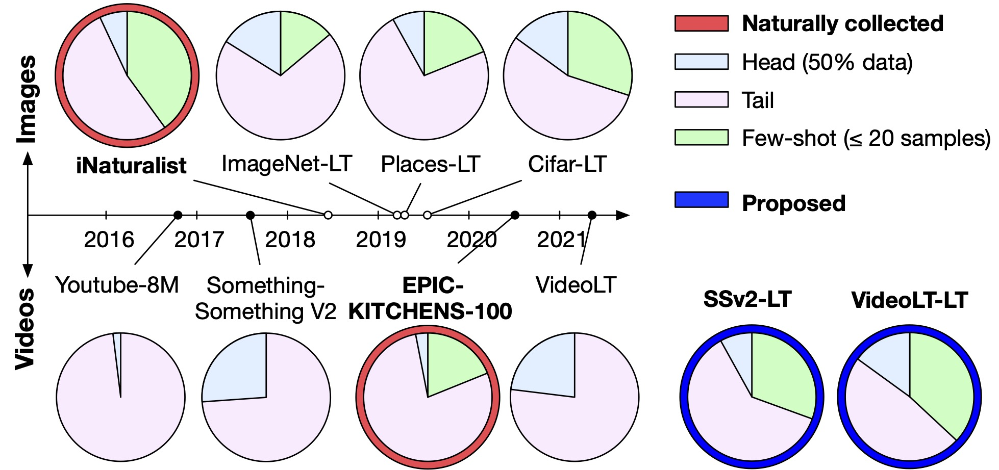
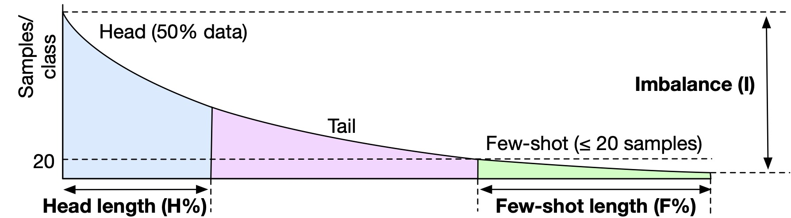
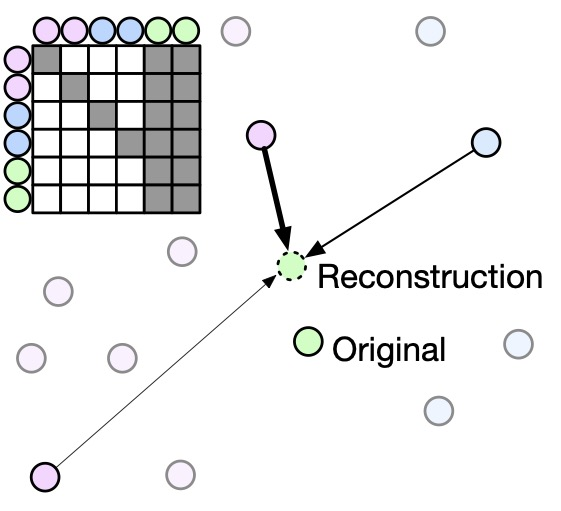
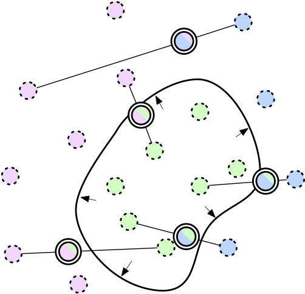

<p align="center">
<a href="https://tobyperrett.github.io/">Toby Perrett</a>, <a href="">Saptarshi Sinha</a>, <a href="http://people.cs.bris.ac.uk/~burghard/">Tilo Burghardt</a>, <a href="http://people.cs.bris.ac.uk/~majid/">Majid Mirmehdi</a> and <a href="https://dimadamen.github.io/">Dima Damen</a>
</p>

<p align="center" style="font-size:30px">
CVPR 2023
</p>

<h3>Introduction</h3>
This paper offers an investigation into long-tailed video recognition, proposes two new benchmarks and then a new method: Long-Tail Mixed Reconstruction (LMR) which produces SOTA results for long-tailed video recognition. We briefly describe our contributions next,

<h3>Datasets and Benchmarks</h3>
In this paper, we first explore <b>long-tail video recognition</b> datasets and works. We find that, unlike naturally-collected video datasets and existing long-tail image benchmarks, current video benchmarks fall short on multiple long-tailed properties (presented next). Most critically, they lack few-shot classes in their tails. In response, we propose new video benchmarks that better assess long-tail recognition, by sampling subsets from two datasets: SSv2 and VideoLT.
<br/><br/>


<p>
<b>Fig:</b> Long-tail image recognition datasets (top) aimed to curate similar distributions to the naturally-collected iNaturalist dataset. For video datasets (bottom), the naturally-collected EPIC-KITCHENS-100 demonstrates a similar distribution of head/tail/few-shot classes to long-tail image datasets. In comparison, curated video datasets do not include any few-shot classes. We propose two versions of existing datasets which do – SSv2-LT and VideoLT-LT. Head/tail/few-shot definitions presented next.
</p>

To compare various long-tail datasets, we define <b>three properties</b> which together allow a more informed comparison of long-tail benchmarks, visualised next.
<br/><br/>

<p align="center" width="100%">
    
</p>
<p>
<b>Fig:</b> Visualisation of long-tail distribution properties: head length (H%), few-shot length (F%) and imbalance (I). Previous works have relied solely on imbalance, or used the terms “head”, “mid” and “tail” to describe different parts of the distribution with arbitrarily chosen sizes. In this paper, we use consistent properties to compare long-tail benchmarks across images and videos.
</p>

Further investigations into the proposed benchmarks are available in our paper.


<h3>Method</h3>
We then propose a method, <b>Long-Tail Mixed Reconstruction (LMR)</b>, which reduces overfitting to instances from few-shot classes by reconstructing them as weighted combinations of samples from head classes. We visualise the method in two figures,


<p align="center" width="100%">
    
</p>
<p>
<b>Fig:</b> The few-shot sample (green) is reconstructed as a weighted sum of other samples in the batch. Few- shot samples are prevented from contributing to the reconstructions through a mask (top left).</p>


LMR then employs label mixing to learn robust decision boundaries. 

<p align="center" width="100%">
    
</p>
<p>
<b>Fig:</b> Reconstructions (dotted outline) increase diversity for few-shot classes, expanding class boundaries. Robust boundaries are learned by pairwise mixing of reconstructions (double outline).</p>

Our proposed method, LMR, achieves state-of-the-art average class accuracy on EPIC-KITCHENS and the proposed SSv2-LT and VideoLT-LT. We share code and models below.

<h3>Paper, Benchmarks, Code and Models</h3>

## Paper

[PDF](use_your_head.pdf)

<a href="https://arxiv.org/abs/2304.01143">arXiv</a>

## Benchmarks

<a href="https://github.com/tobyperrett/lmr-release#lt-dataset-splits">Long-Tail Splits</a>

## Code

<a href="https://github.com/tobyperrett/lmr-release">GitHub</a>

## Bibtex

When using the code or method, please cite our paper:

```BibTeX
@inproceedings{perrett2023,
   title={Use Your Head: Improving Long-Tail Video Recognition}, 
   author={Perrett, Toby and Sinha, Saptarshi and Burghardt, Tilo and Mirhemdi, Majid and Damen, Dima},
   year={2023},
   booktitle={Computer Vision and Pattern Recognition},
}
```

When using our benchmarks, please cite our paper as well as the three datasets (EPIC-KITCHENS, SSv2 and VideoLT) which we build on:
```BibTeX
@inproceedings{perrett2023,
   title={Use Your Head: Improving Long-Tail Video Recognition}, 
   author={Perrett, Toby and Sinha, Saptarshi and Burghardt, Tilo and Mirhemdi, Majid and Damen, Dima},
   booktitle={Proceedings of the IEEE/CVF Computer Vision and Pattern Recognition},
   year={2023}
}
```
```BibTeX
@inproceedings{Damen2022RESCALING,
           title={Rescaling Egocentric Vision: Collection, Pipeline and Challenges for EPIC-KITCHENS-100},
           author={Damen, Dima and Doughty, Hazel and Farinella, Giovanni Maria and Furnari, Antonino 
           and Ma, Jian and Kazakos, Evangelos and Moltisanti, Davide and Munro, Jonathan 
           and Perrett, Toby and Price, Will and Wray, Michael},
           journal   = {International Journal of Computer Vision (IJCV)},
           year      = {2022},
           volume = {130},
           pages = {33–55},
           Url       = {https://doi.org/10.1007/s11263-021-01531-2}
}
```
```BibTeX
@InProceedings{Goyal_2017_ICCV,
    author = {Goyal, Raghav and Ebrahimi Kahou, Samira and Michalski, Vincent and Materzynska, Joanna and Westphal, Susanne and Kim, Heuna and Haenel,  Valentin and Fruend, Ingo and Yianilos, Peter and Mueller-Freitag, Moritz and Hoppe, Florian and Thurau, Christian and Bax, Ingo and Memisevic, Roland},
    title = {The "Something Something" Video Database for Learning and Evaluating Visual Common Sense},
    booktitle = {Proceedings of the IEEE International Conference on Computer Vision (ICCV)},
    year = {2017}
}
```
```BibTeX
@InProceedings{Zhang_2021_ICCV,
    author    = {Zhang, Xing and Wu, Zuxuan and Weng, Zejia and Fu, Huazhu and Chen, Jingjing and Jiang, Yu-Gang and Davis, Larry S.},
    title     = {VideoLT: Large-Scale Long-Tailed Video Recognition},
    booktitle = {Proceedings of the IEEE/CVF International Conference on Computer Vision (ICCV)},
    year      = {2021},
    pages     = {7960-7969}
}
```

<h3>Acknowledgement</h3>
We use publicly available datasets and publish our proposed benchmarks. Research is funded by <a href="https://gow.epsrc.ukri.org/NGBOViewGrant.aspx?GrantRef=EP/T004991/1">EPSRC UMPIRE (EP/T004991/1)</a>, <a href="https://gow.epsrc.ukri.org/NGBOViewGrant.aspx?GrantRef=EP/R005273/1">EPSRC SPHERE Next Steps (EP/R005273/1)</a>, EPSRC DTP and <a href="https://gow.epsrc.ukri.org/NGBOViewGrant.aspx?GrantRef=EP/T028572/1">EPSRC PG Visual AI (EP/T028572/1)</a>. We acknowledge the use of <a href="https://www.jade.ac.uk">HPC Tier 2 Facility Jade 2</a> and Bristol’s Blue Crystal 4 facility.
